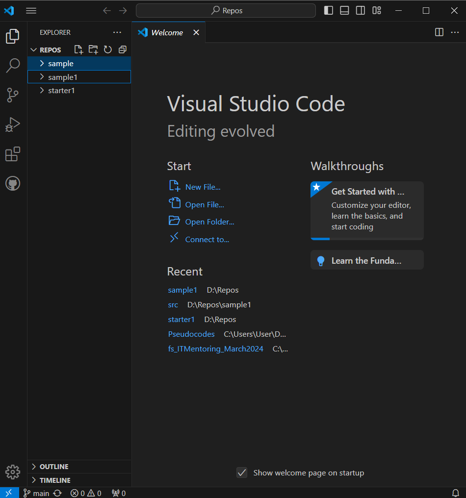

# Sample-html WebSite

it is my 2nd static website

## Section 1

```javascript
console.log(`${Date()} :: This is a starter template for a simple web app.`);
```

### Creating the repository

Step 1= creating a repository namely:sample


#### Cloning the repository to GitHub desktop

Step 2= Cloning the repository to GitHub desktop


#### Opening in visual studio code

Step 3= Opening in visual studio code


##### Creating two folders in VS Code

1: Create a folder named documentation, create a folder in documentation for images.
2: Create a folder named src


##### Creating three files in src

1: Create a file named index.html
2: Create a file named script.js
3: Create a file named styles.css

##### HTML

```<!DOCTYPE html>
<html lang="en">

<head>
    <meta charset="UTF-8">
    <meta name="viewport" content="width=device-width, initial-scale=1.0">
    <link rel="icon" href="favicon.ico" type="image/x-icon">
    <link rel="stylesheet" href="https://cdnjs.cloudflare.com/ajax/libs/font-awesome/6.5.2/css/all.min.css"
        integrity="sha512-SnH5WK+bZxgPHs44uWIX+LLJAJ9/2PkPKZ5QiAj6Ta86w+fsb2TkcmfRyVX3pBnMFcV7oQPJkl9QevSCWr3W6A=="
        crossorigin="anonymous" referrerpolicy="no-referrer" />
    <link rel="stylesheet" href="styles.css" />
    <meta charset="UTF-8">
    <meta name="viewport" content="width=device-width, initial-scale=1.0">
    <title>Irtiqa's Jewelry Shop</title>
</head>

<body>
    <div>
        <h1>Irtiqa's Jewelry Shop <i class="fa-solid fa-snowflake"></i></h1>
        <h1><i class="fa-solid fa-ring"></i></i></h1>
    </div>
</body>

</html>
```

#### CSS

```@import url('https://fonts.googleapis.com/css2?family=Roboto:wght@400;700&display=swap');
@import url('https://fonts.googleapis.com/css2?family=Montserrat:wght@900&display=swap');

* {
    box-sizing: border-box;
}

body {
    font-family: 'Roboto', 'Montserrat', sans-serif;
    display: flex;
    flex-direction: column;
    align-items: center;
    height: 100vh;
    justify-content: center;
    overflow: hidden;
    margin: 0;
}

h1 {
    font-size: 3rem;
    margin-bottom: 1rem;
    color: #1C1678;
}

i {
    font-size: 5rem;
    margin-bottom: 1rem;
    color: blueviolet;
}
```

##### script.js

``` console.log(`${Date()} :: This is a starter template for a simple web app.`);
```
